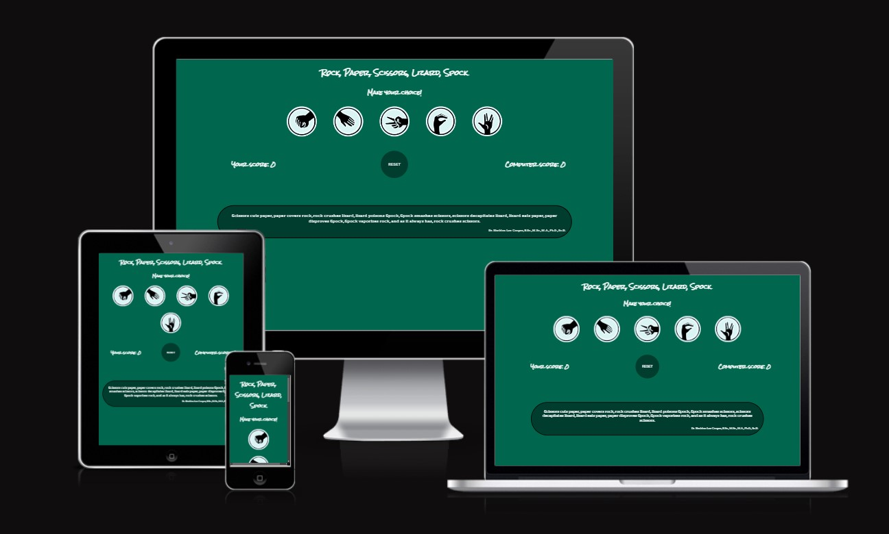
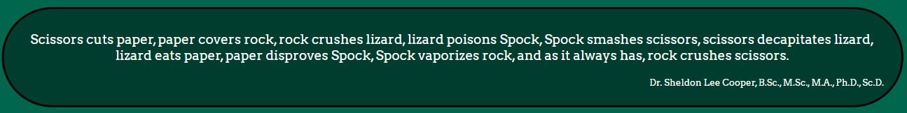

<h1>Rock, Paper, Scissors, Lizard, Spock game</h1>
 

A classic and fun game to decide who goes first in a company of friends made even more fun. With expanded choices from 79 award winning, one of the most popular TV show "The Big Bang Theory".

Users of the game will learn the rules and have a truly random game outcome and if players want to leave their life choices to 100% random decision making, this is it!

 

<h2>Features</h2>

<ul>
<li>Header
<ul><li>To let player know the game they are playing.</li></ul>
</li></ul>

 
<ul><li>Game options
<ul>
<li>5 different choices to pick against computer, with clear images and titles.</li>
<li>These images are interactive buttons, that player can click on their chosen option and the game will run.</li>
<li>When user hovers over the button, it will increase in size.</li>
</ul>
</li></ul>

 
<ul><li>Game Rules
<ul>
<li>When option is selected by the player, their and also computer choice will be shown below the button options.</li>
<li>Winner of the round is shown in the middle of the screen with relative colours, you could also draw, if both player and computer pick the same option.</li>

  
  
  

<li>Player and Computer, left and right of the screen respectively, score counter is just below options and round winner</li>
<li>Reset interactive button,to reset game scores to 0, is located in the middle, between score counters.</li>
</ul>
</li></ul>
  

 
<ul><li>Footer
<ul>
<li>Footer is valuable to new players who are playing the game first time, as it contains rules of the game, explained by a direct quote from  Dr. Sheldon Cooper himself.</li>
</ul>
</li></ul>
  

<h2>Testing</h2>
<ul>
<li>Have tested the game with different browsers and a few mobile phones and it works without issues.</li>
<li>Have confirmed that decision making in javascript is working correctly.</li>
